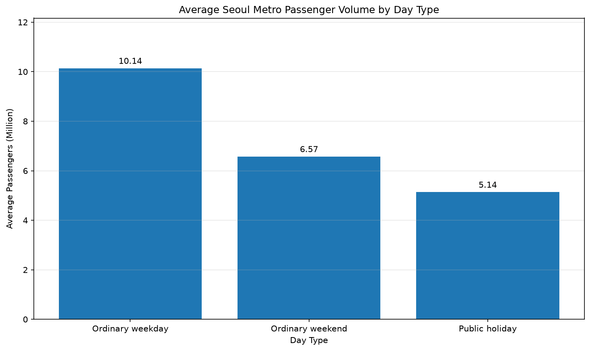
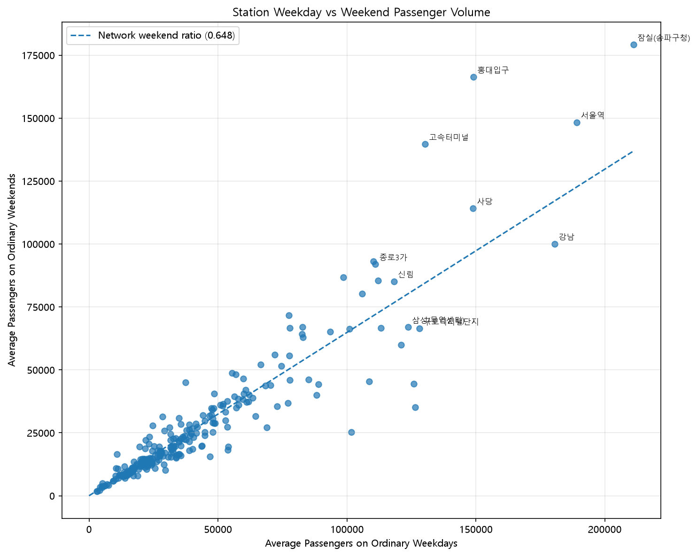
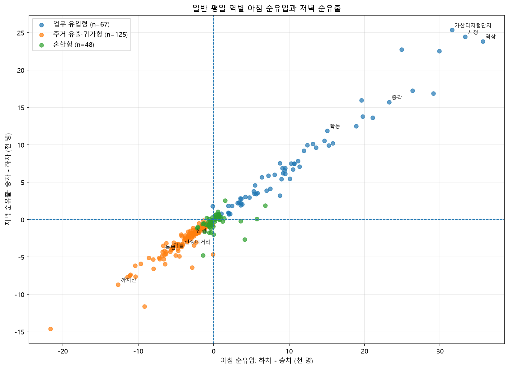
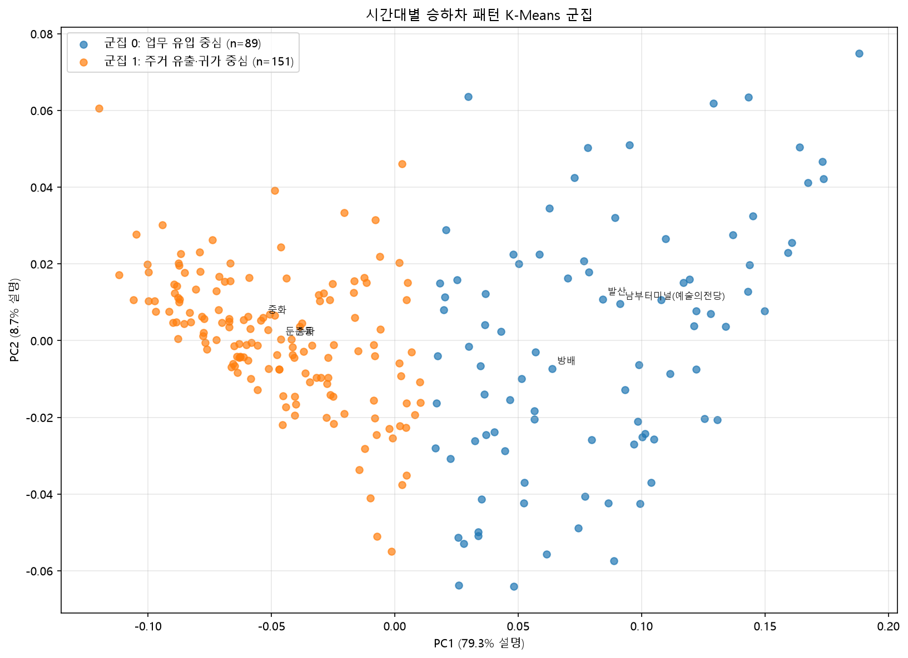
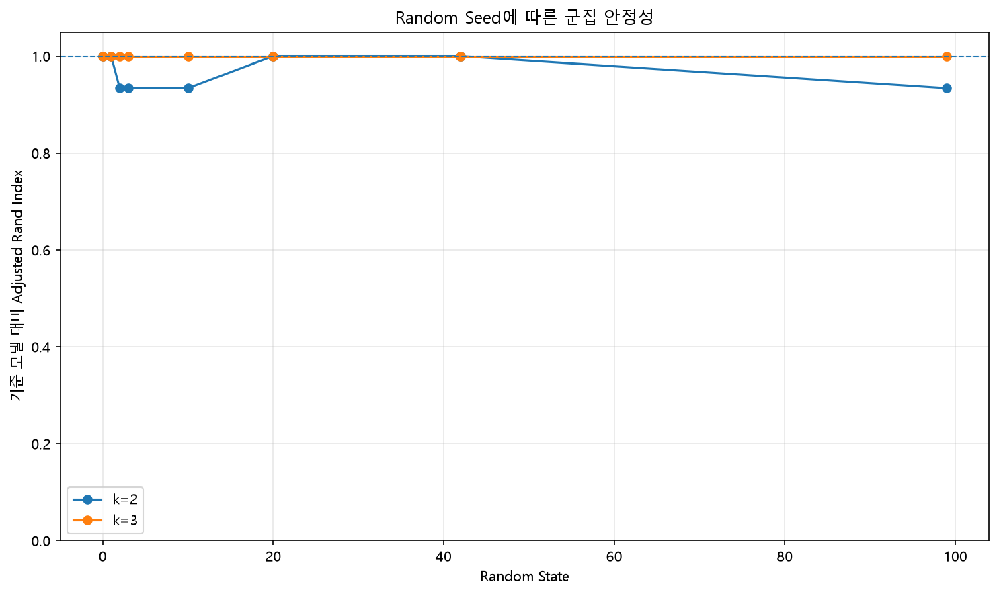

# MOBIUS: Seoul Metro Mobility Pattern Analytics

서울 지하철 공개 승하차 데이터를 이용해 도시 이동 패턴을 분석하고,
데이터 품질 검증부터 시계열.행동 패턴 세분화까지 구현한 데이터 분석 프로젝트입니다.

이 프로젝트는 단순한 시각화가 아니라 다음 질문에 답하는 것을 목표로 합니다.

- 평일, 주말, 공휴일의 이용량은 얼마나 다른가?
- 역마다 평일과 주말의 이용 패턴은 어떻게 다른가?
- 아침과 저녁의 승차.하차 방향으로 역의 이동 흐름을 구분할 수 있는가?
- 정한 규칙이 없이도 시간대 패턴만으로 역을 군집화할 수 있는가?
- 군집 결과는 초기값이 달라져도 안정적으로 유지되는가?

---

## Key Findings

### 1. 평일.주말.공휴일 효과

- 일반 평일 일평균: **10,137,800명**
- 일반 주말 일평균: **6,573,275명**
- 공휴일인 평일 일평균: **5,063,210명**
- 일반 주말은 일반 평일보다 **35.2% 낮음**
- 공휴일인 평일은 일반 평일보다 **50.1% 낮음**



### 2. 평일.주말 역 프로파일

240개 물리적 역을 네트워크 전체 주말 비율과 비교했습니다.

- 평일 집중형: **38개**
- 균형형: **167개**
- 주말 상대강세형: **35개**



### 3. 출퇴근 이동 방향

일반 평일의 아침 07~10시와 저녁 17~20시 승차.하차 흐름을 분석했습니다.

- 업무 유입형: **67개**
- 주거 유출.귀가형: **125개**
- 혼합형: **48개**

업무 유입형은 아침 하차와 저녁 승차가 강했고,
주거 유출.귀가형은 아침 승차와 저녁 하차가 강했습니다.



### 4. 시간대 패턴 기반 군집화

20개 시간대의 승차 비중과 20개 하차 비중을 사용하여
역당 40개의 패턴 변수를 구성했습니다.

절대 이용량과 기존 규칙 유형은 군집화 입력에 사용하지 않았습니다.

- 최적 군집 수: **k=2**
- Silhouette Score: **0.4933**
- PCA 두 축 누적 설명 분산: **88.0%**



### 5. 군집 안정성

여러 Random State에서 K-Means를 반복 학습했습니다.

| 군집 수 | 평균 ARI | 최소 ARI | Silhouette |
|---:|---:|---:|---:|
| 2 | 0.9669 | 0.9338 | 0.4933~0.4968 |
| 3 | 1.0000 | 1.0000 | 0.3891 |

k=2는 분리도가 높았고, k=3은 혼합 흐름을 별도로 분리하면서
테스트한 모든 초기값에서 동일한 결과를 생성했습니다.

최종적으로 k=2를 핵심 세그먼트,
k=3을 상세 설명을 위한 보조 세분화로 사용했습니다.



---

## Temporal Stability

전체 연도 데이터에서 확인한 군집 구조가 특정 기간에만 나타난 결과인지 검증하게 위해,
2025년 일반 평일을 상반기 119일과 하반기 125일로 분리해 각각 다시 군집화했습니다.

| 군집 수 | ARI | NMI | 의미 기반 유지율 | 전환 역 |
|---:|---:|---:|---:|---:|
| 2 | 0.9338 | 0.8890 | 98.33% | 4개 |
| 3 | 0.8849 | 0.8652 | 96.25% | 9개 |

k=2에서는 전체 240개 역 중 236개가 동일한 이동 유형을 유지했습니다.

전환된 4개 역은 모두 군집 경계에 가까웠으며,
상.하반기의 방향성 점수 자체는 크게 변하지 않았습니다.
따라서 해당 결과를 역 기능의 급격한 변화가 아니라
경계 관측치의 군집 배정 변화로 해석했습니다.

k=3의 전환도 모두 혼합 군집과 인접 군집 사이에서 발생했고,
업무 유입 중심과 주거 유출.귀가 중심 사이의 직접 전환은 없었습니다.

시간대 프로파일 변화가 큰 역과 군집 전환 역은 반드시 일치하지 않았습니다.

## Data Pipeline

```text
Raw CSV
    ↓
데이터 타입·결측·중복 검증
    ↓
Wide → Long 변환
    ↓
역사명 변경 표준화
    ↓
공휴일·요일 데이터 결합
    ↓
역·날짜·시간대·승하차 데이터마트
    ↓
평일·주말 프로파일
    ↓
시간대 방향성 분석
    ↓
K-Means 군집화
    ↓
군집 수 및 안정성 검증
```

---

## Data Quality Controls

분석 과정에서 다음 검증을 자동으로 수행했습니다.
- 원본 파일의 완전 공백 행 탐지
- 완전 중복 및 분석 키 중복 검사
- Wide->Long 변환 전후 예상 행 수 검증
- 날짜.노선.역.승하차 결측 검사
- 음수 승객 수 검사
- 역별 365일 관측 커버리지 검사
- 일반 평일 244일 관측 커저리지 검사
- 역사명 변경 표준화
- 분석 단계 간 이용량 집계 결과 비교
- 시간대 비중 합계 검증

2025년 중 변경된 역사명은 다음과 같이 표준화했습니다.
```text
당고개 → 불암산
삼각지 → 삼각지(전쟁기념관)
```

---

## Repository Structure

```text
.
├─ data/
│  ├─ README.md
│  ├─ raw/
│  └─ processed/
├─ docs/
│  └─ research_log_*.md
├─ reports/
│  ├─ figures/
│  └─ tables/
├─ src/
│  ├─ 01_data_audit.py
│  ├─ 02_clean_and_weekday_analysis.py
│  ├─ 03_holiday_analysis.py
│  ├─ 04_station_daytype_profile.py
│  ├─ 05_station_time_direction_profile.py
│  ├─ 06_station_pattern_clustering.py
│  └─ 07_k2_k3_stability_analysis.py
├─ requirements.txt
├─ requirements-lock.txt
├─ environment.yml
└─ README.md
```

---

## How to Run

### 1. 환경 생성

```bash
conda env create -f environment.yml
conda activate mobius-urban-mobility
```

또는:

```bash
python -m venv .venv
pip install -r requirements.txt
```

### 2. 원본 데이터 배치

원본 CSV를 다음 위치에 저장합니다.

```text
data/raw/subway_2025.csv
```

### 3. 분석 실행

프로젝트 최상위 폴더에서 순서대로 실행합니다.

```bash
python src/01_data_audit.py
python src/02_clean_and_weekday_analysis.py
python src/03_holiday_analysis.py
python src/04_station_daytype_profile.py
python src/05_station_time_direction_profile.py
python src/06_station_pattern_clustering.py
python src/07_k2_k3_stability_analysis.py
```

각 단계는 이전 단계의 산출물을 입력으로 사용합니다.

---

## Main Output

| 단계 | 주요 결과 |
|---:|---:|
| 01 | 일별 전체 이용량 |
| 02 | Long Format 데이터와 요일별 통계 |
| 03 | 일반 평일.주말.공휴일 비교 |
| 04 | 역별 평일.주말 프로파일 |
| 05 | 시간대.승하차 방향성 분석 |
| 06 | 시간대 패턴 K-Means 군집화 |
| 07 | k=2 k=3 비교 및 Seed 안정성 |

핵심 요약 결과는 `reports/` 폴더에서 확인할 수 있습니다.

---

## Interpretation Policy

이 프로젝트는 집계된 역 단위 승하차 데이터를 사용합니다.

따라서 다음을 직접적으로 주장하지 않습니다.

- 개별 이용자의 이동 경로
- 개인 단위 통근 또는 소비 행동
- 역 주면의 실제 토지 이용 유형
- 군집 결과와 특정 시설 간의 인과관계 

`업무 유입형`, `주거 유출.귀가형`, `주말 상대 강세형` 등의 명칭은
관측된 이동 패턴을 설명하기 위한 탐색적 이름입니다.

---

## Limitations

- 서울교통공사 1~8호선 집계 데이터만 사용했습니다.
- 환승 승객과 역 외부 출입 승객을 분리할 수 없습니다.
- 아침과 저녁 첨두시간을 고정된 구간으로 정의했습니다.
- K-Means는 유클리드 거리와 구형 군집을 가정합니다.
- Seed 안정성은 검증했지만 기간 변화에 대한 안정성은 아직 검증하지 않았습니다.
- 토지 이용, 상권, 날씨, 행사 데이터는 아직 결합하지 않았습니다.

---

## Roadmap

- 상반기.하반기 군집 안정성 검증
- 날짜 단위 수요 예측 기준모델 구축
- 예측 잔차 기반 이상 탐지
- 외부 이벤트 영향 분석
- 역사 좌표와 상권 데이터 결합
- 분석 결과 대시보드 구축
